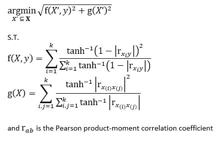
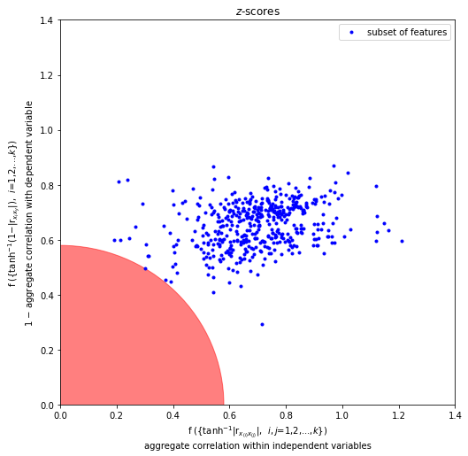

# zDistance
This project aims to reduce the risk of multicollinearity in a subset of independent variables for regression analysis. The purpose is to identify a subset of variables from a large list of independent variables that can be used in regression analysis to reduce the chance of multicollinearity causing a problem. Provided is a class that automates this task. The problem is formulated as:

The function z_distance accepts a dataframe, a list of independent variables, and a dependent variables. The algorithm first creates subsets from the list of independent variables. The subsets consist of every combination from the list of independent variables, ranging in length from k (the number of independent variabes passed to the class) and the minimum combination length passed to the class. Once combinations are made, pearson correlation coefficients are calculated for every pair of variables within each subset/combination. Fisher's z Transformation is applied to the absolute value of each of these coefficients, they are then aggregated by either taking their weighted mean. Aggregated coefficients for the correlation between each variable in a subset and the dependent variable are calculated in the same way. 

The goal is now to find a subset/combination that simultaneously has the lowest coefficient of aggregated correlation for each pair in the subset as well as the highest coefficient of aggregated correlation for each variable in the subset with the dependent variable. This is found by first changing the later maximization into a minimization by simply subtracting each correlation coefficient from 1. A minimum for these two criteria can be found by calculating the euclidian distance of each combination from 0 (the lowest possible coefficient possible for either set of coefficients). A penalty can then optionally be added to the distance coefficient - smaller combination lengths have larger distance penalties.

See this blog post for more details: [Variable Selection in Regression Analysis with a Large Feature Space](https://towardsdatascience.com/variable-selection-in-regression-analysis-with-a-large-feature-space-2f142f15e5a)

